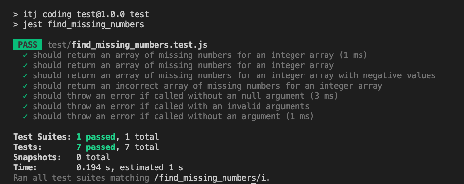
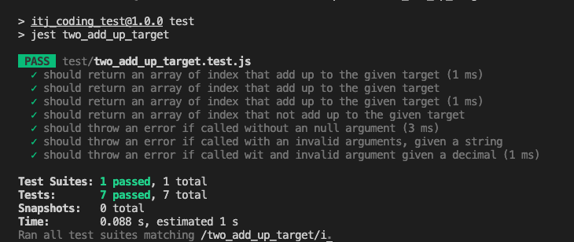

# Coding Test ITJ

## Installation 

Running the following command
```bash
npm install
```

## Running Tests

Run all tests
```bash
npm test
```
#

## Problem 1

Given a list nums of n integers where nums[i] is in the range [1, list length], write a function
that solves the following problem; return a list of all the integers in the range [1, list length]
that do not appear in nums.

#

## Solution


The first thing to consider is that we need to know every number we have to compare with 
the the given list of numbers, so that is why I created an empty array with the length
of the list,after this I decided to use 2 loops
```javascript
const range = Array.from({ length: numbers.length + 1 }) // [undefined, undefined]
```

the first loop is to get all numbers we have setting a true value as a flag and the numbers that are
missing contain an undefined value

```javascript
range[number] = true // [true, undefined]
```

The second loop is to get all numbers that are without the flag and push into a new array
```javascript
if (!range[index]) missing_numbers.push(index)
```

After the 2 loops, return the new array that contains the numbers that were missing

# 
## Unit Test
There are the basic tests to consider

- Output
    - Is correct
    - Is incorrect
- Input
    - Is defined
    - Is null
    - Is an invalid expecting and array of integers




#

## Problem 2

Given a list of integers nums and an integer target, write a function that solves the following
problem; return indices of the two numbers such that they add up to target.

#

## Solution

We can start using a loop that will
interate until we find the two indexes by subtracting the number given with the index
and then we will use this using the function indexof to find the second index to get the two 
numbers that add up, if the diff number does not exist in the given array
it continues the loop and the validation we need is only to consider that we cant use the same index twice

- Get the diff number by subtracting the number obtained by the index of the target
```javascript
const diff = target - numbers[i]
```

- Check if the diff value exists in the array and save it
```javascript
const index = numbers.indexOf(diff) 
```

- Validate if the diff index is not the same as the first index and return the indexes
```javascript
if (index !== -1 && index !== i ) return [i, index]
```
# 
## Unit Test
There are the basic tests to consider

- Output
    - Is correct
    - Is incorrect
- Input
    - Is defined
    - Is null
    - Is an invalid argument given a string, decimal not an integer for the two arguments




